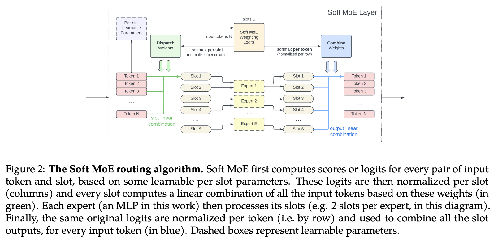

</img>

</img>

## Soft MoE - Pytorch (wip)

Implementation of <a href="https://arxiv.org/abs/2308.00951">Soft MoE (Mixture of Experts)</a>, proposed by Brain's Vision team, in Pytorch.

This MoE has only been made to work with non-autoregressive encoder. However, some recent <a href="https://arxiv.org/abs/2305.18295">text-to-image models</a> have started using MoE with great results, so may be a fit there.

If anyone has any ideas for how to make it work for autoregressive, let me know (through email or discussions). I meditated on it but can't think of a good way. The other issue with the slot scheme is that the routing suffers the quadratic as sequence length increases (much like attention)

## Appreciation

- <a href="https://stability.ai/">StabilityAI</a> for the generous sponsorship, as well as my other sponsors out there

- <a href="https://github.com/arogozhnikov/einops">Einops</a> for making my life easy

## Install

```bash
$ pip install soft-moe-pytorch
```

## Usage

```python
import torch
from soft_moe_pytorch import SoftMoE

moe = SoftMoE(
    dim = 512,         # model dimensions
    seq_len = 1024,    # max sequence length (will automatically calculate number of slots as seq_len // num_experts) - you can also set num_slots directly
    num_experts = 4    # number of experts - (they suggest number of experts should be high enough that each of them get only 1 slot. wonder if that is the weakness of the paper?)
)

x = torch.randn(1, 1024, 512)

out = moe(x) + x # (1, 1024, 512) - add in a transformer in place of a feedforward at a certain layer (here showing the residual too)
```

For an improvised variant that does dynamic slots so that number of slots ~= sequence length, just import `DynamicSlotsSoftMoe` instead

```python
import torch
from soft_moe_pytorch import DynamicSlotsSoftMoE

# sequence length or number of slots need not be specified

moe = DynamicSlotsSoftMoE(
    dim = 512,         # model dimensions
    num_experts = 4,   # number of experts
    geglu = True
)

x = torch.randn(1, 1023, 512)

out = moe(x) + x # (1, 1023, 512)
```

## Todo

-  [x] address the limitation of number of slots being fixed. think about a way to make dynamic number of slots based on sequence length

## Citations

```bibtex
@misc{puigcerver2023sparse,
    title 	= {From Sparse to Soft Mixtures of Experts}, 
    author 	= {Joan Puigcerver and Carlos Riquelme and Basil Mustafa and Neil Houlsby},
    year 	= {2023},
    eprint 	= {2308.00951},
    archivePrefix = {arXiv},
    primaryClass = {cs.LG}
}
```

```bibtex
@misc{shazeer2020glu,
    title   = {GLU Variants Improve Transformer},
    author  = {Noam Shazeer},
    year    = {2020},
    url     = {https://arxiv.org/abs/2002.05202}
}
```

